# Visual guide (screenshots)

**Real screenshots** from [hotel-restaurant-minimart.firebaseapp.com](https://hotel-restaurant-minimart.firebaseapp.com/) — captured from the live app. Use this guide when training staff; open the same topics **inside the app** via **☰ Menu → Help → Documentation**.

---

## 1. Sign-in screen

Demo credentials are available on the login screen (password **1234** for all demo users).

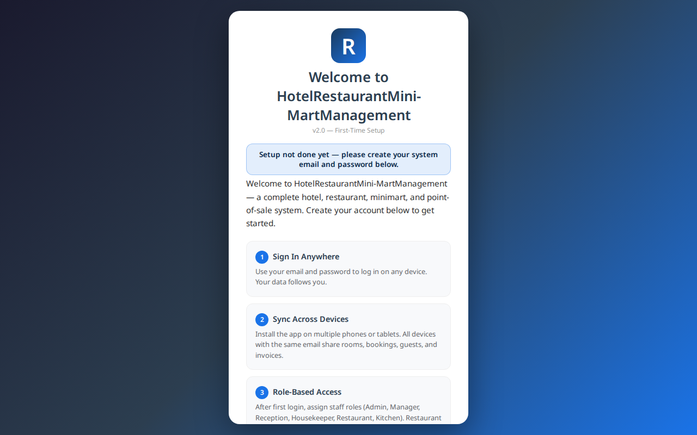

> **Caption:** Choose interface language, enter email/password, or tap a demo row.

See [Demo credentials](demo-credentials.md) and [First-time setup](first-time-setup.md).

---

## 2. Dashboard

Default landing for most roles. Shows **shift status** (Restaurant, Mini-Mart, Hotel), date filters, and operation analytics.


> **Caption:** Open shifts with **OPEN SHIFT**; use date range or **LAST 30 DAYS** for reports.

See [Reports](reports.md).

---

## 3. Help menu (sidebar)

Tap **☰** (top-left) or **Menu** on mobile. **Help → Documentation** is at the **top** of the sidebar.

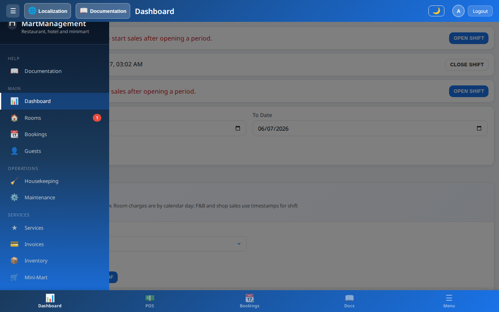

> **Caption:** Documentation is embedded in the app — not a separate website.

See [Navigation & UI](navigation-and-ui.md).

---

## 4. Documentation (embedded in app)

Full user guide opens **inside** the software in your **current language** (21 locales).

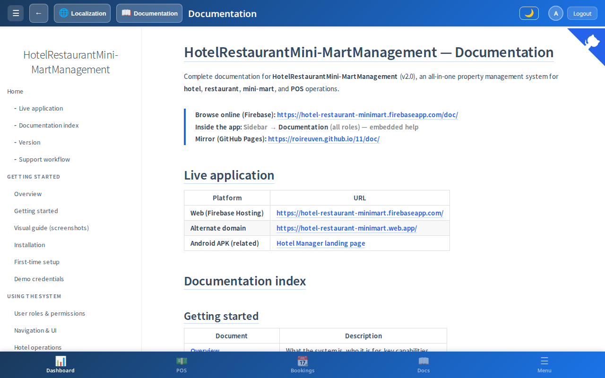

> **Caption:** Also available from top bar **Documentation** and mobile bottom **Docs**.

See [Multilingual documentation](multilingual-documentation.md).

---

## 5. Rooms

Room grid: occupancy, housekeeping status, rates, maintenance badges.

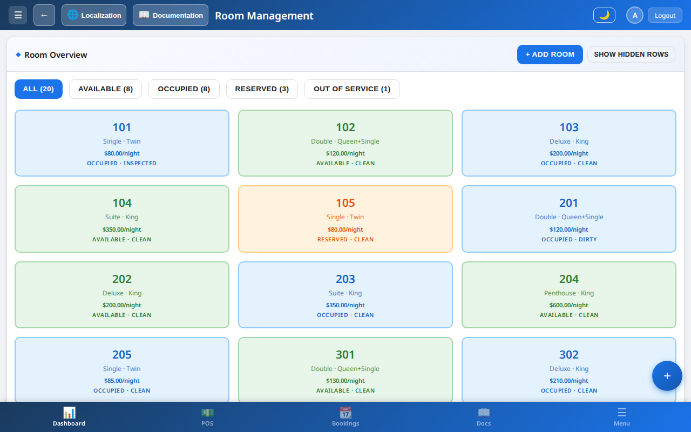

See [Hotel operations](hotel-operations.md).

---

## 6. Bookings

Reservations, check-in/out, guest linking, invoices.

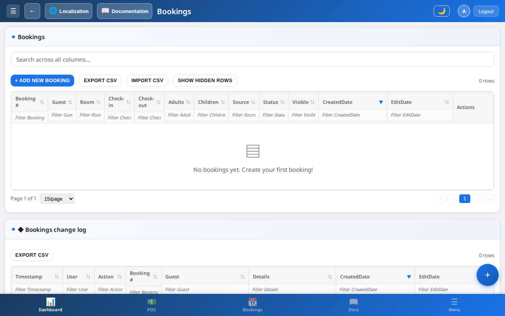

---

## 7. Housekeeping

Floor board — tap room cards to cycle cleaning status.

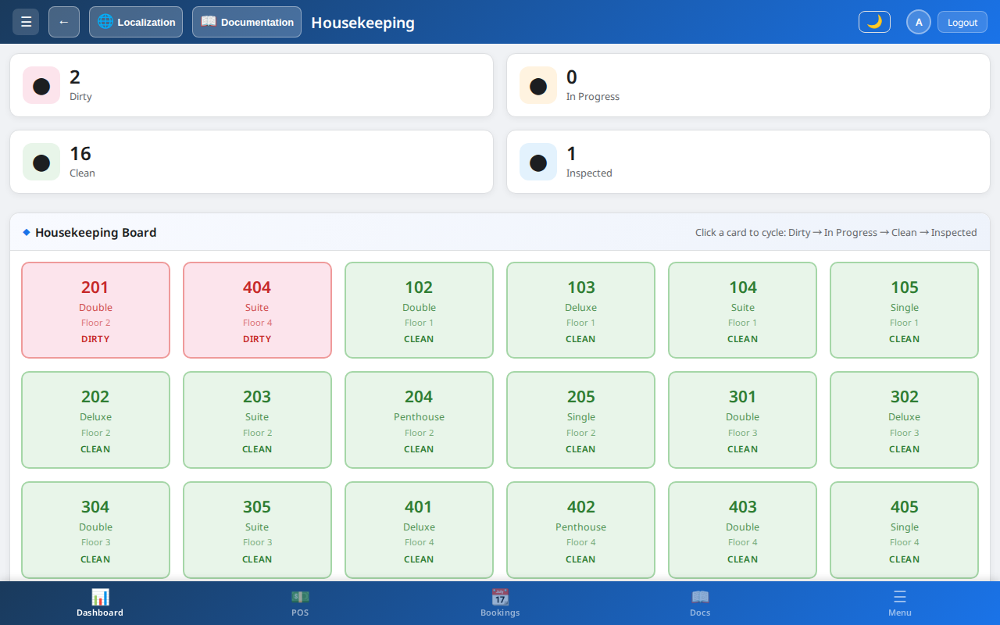

---

## 8. Restaurant & kitchen

Table floor, room service, kitchen queue, payments.

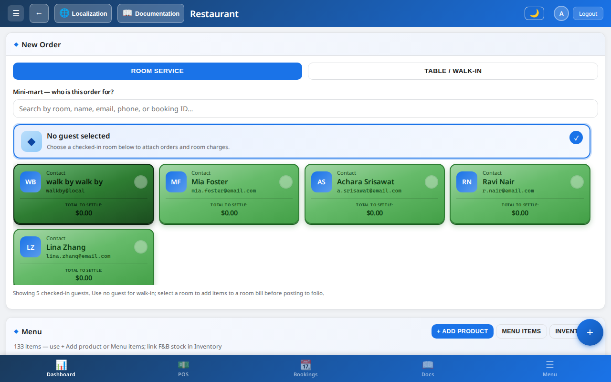

See [Restaurant & kitchen](restaurant-and-kitchen.md).

---

## 9. Mini-mart / POS

Shop sales — walk-in cash/card or **charge to room**.

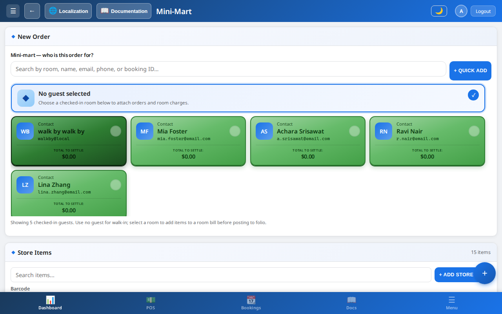

See [Mini-mart & POS](minimart-and-pos.md).

---

## 10. Invoices

Guest folios, line items, checkout billing.

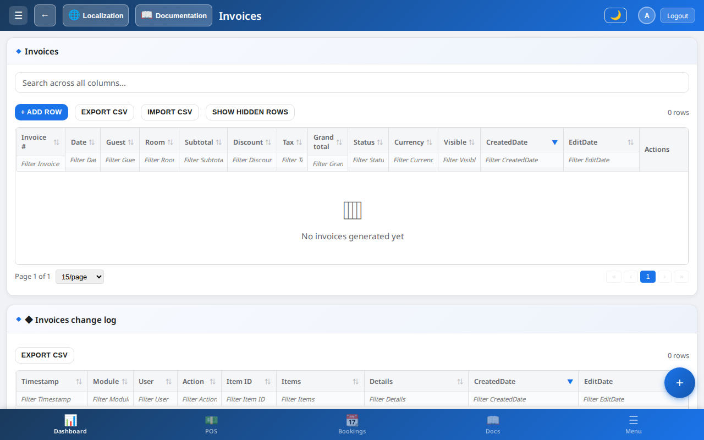

See [Services & billing](services-and-billing.md).

---

## 11. Settings (Admin)

Hotel profile, currency, taxes, seasons, backup, danger zone.

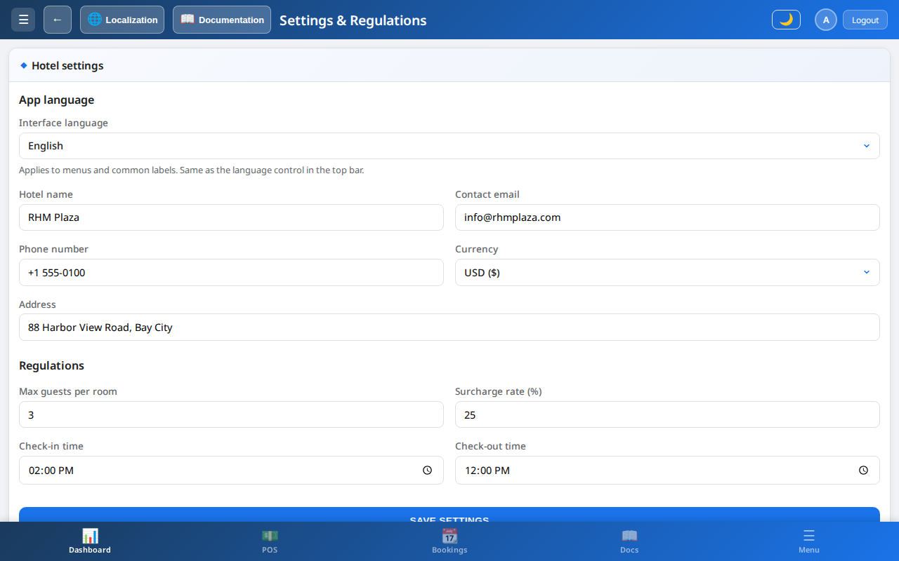

See [Settings & configuration](settings-and-configuration.md).

---

## 12. Reports (Manager)

Department sales, occupancy, shift summaries.

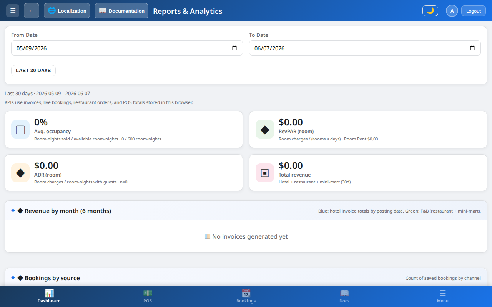

---

## 13. Accounts (Admin)

Staff users, roles, passwords.

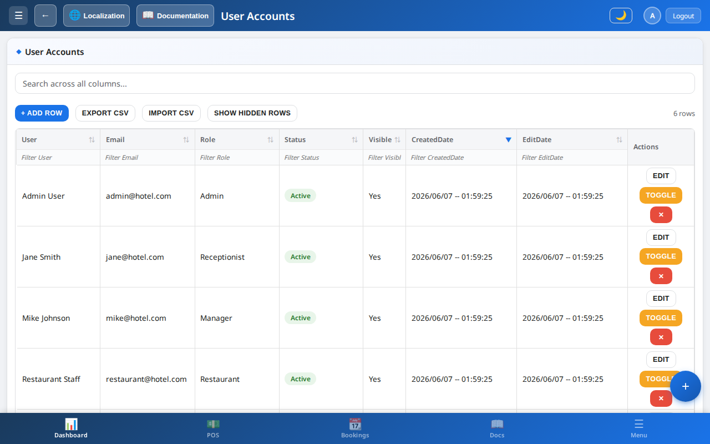

See [Accounts & audit](accounts-and-audit.md).

---

## 14. Guest portal

In-stay guest requests and portal activity (Reception / Manager / Admin).

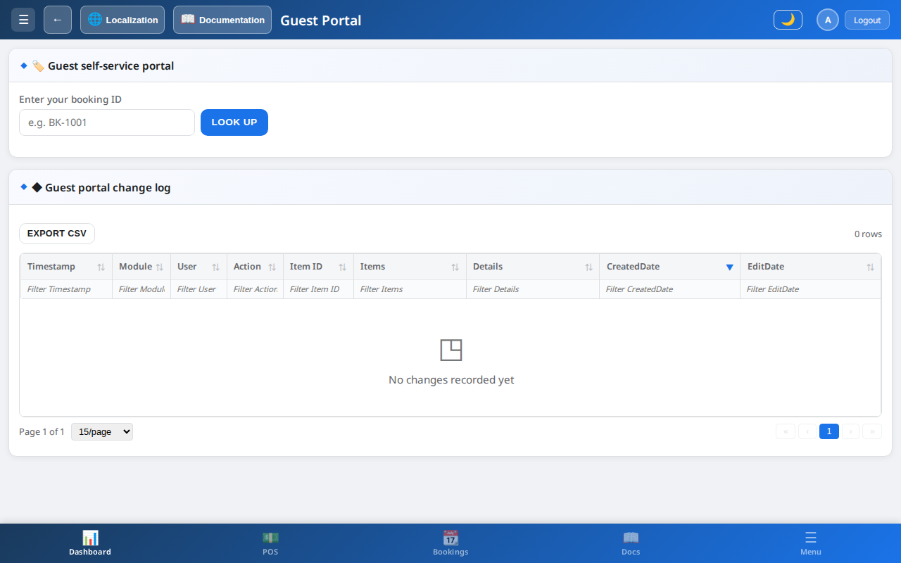

See [Guest portal](guest-portal.md).

---

## 15. Mobile bottom navigation

On phones: **Dashboard · POS · Bookings · Docs · Menu**.

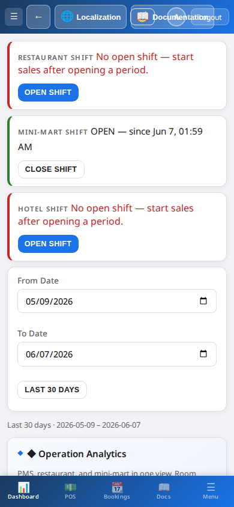

> **Caption:** **Docs** opens the same embedded documentation as the desktop Help menu.

---

## Refreshing screenshots (developers)

From repo root, after the live app is updated:

```bash
npm install
node scripts/capture-doc-screenshots.mjs
npm run deploy
```

Requires Playwright (`npx playwright install chromium`).

## Related

- [Getting started](getting-started.md)
- [Navigation & UI](navigation-and-ui.md)
- [User roles & permissions](user-roles-and-permissions.md)
