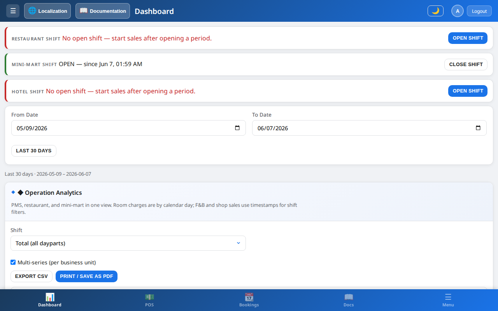

# Overview

## What is HotelRestaurantMini-MartManagement?

**HotelRestaurantMini-MartManagement** is a unified management application for small and mid-size hospitality properties that combine:

- **Hotel / PMS** — rooms, bookings, check-in/out, housekeeping
- **Restaurant** — table service, room service, kitchen display
- **Mini-mart / shop** — retail items sold on-site
- **POS** — point-of-sale for walk-in and room-charge sales

Staff use a **single app** with **role-based menus** and **in-app documentation** (Help → Documentation) in 21 languages.

> Open **☰ Menu → Help → Documentation** for the full illustrated guide ([Visual guide](visual-guide.md)).

## Tagline

> Restaurant, hotel and minimart

## Who is it for?

| Audience | Typical tasks |
|----------|----------------|
| **Property owner / Admin** | Setup, accounts, settings, audit, full access |
| **Manager** | Reports, inventory, overrides, analytics |
| **Reception** | Rooms, bookings, guests, invoices, check-in/out |
| **Housekeeper** | Room cleaning status, maintenance tickets |
| **Restaurant staff** | Orders, menu, F&B stock (no room management) |
| **Kitchen staff** | Live order queue — prep, ready, served (no payments) |

## Key capabilities

### Hotel (PMS)

- Room inventory with types, floors, rates, amenities
- Booking lifecycle: create, check-in, check-out, invoice
- Guest directory with passport, VIP, blacklist, visit history
- Housekeeping board (Dirty → In Progress → Clean → Inspected)
- Maintenance tickets linked to rooms
- Extra services and room charges

### Restaurant & kitchen

- Table floor with free / open / pay-due status
- Room service orders tied to checked-in guests
- Kitchen queue synced with restaurant (New → Preparing → Ready → Served)
- Menu items with categories and optional recipe/inventory links
- Order history and void support
- **Guest QR self-order** — scan-to-order with order numbers **1–60**
- **QR Orders Report** — charts, slot board, spreadsheet, CSV export

### Mini-mart & POS

- Store items with stock and barcodes
- Walk-in cash/card sales
- **Put bill on customer** — charge to guest room before payment
- Shared inventory with F&B where configured
- **Guest QR self-order** for counter/shop customers (order # 1–60)
- **QR Orders Report** on mini-mart screen

### Administration

- Multi-language UI (21 locales) including guest QR and report strings
- Full-screen modals for QR and operational pop-ups
- Dark mode
- CSV/ZIP export (all tables) and JSON backup/restore with import confirmation
- Audit and change logs per module
- Configurable dropdown lists (currencies, room types, payment methods, etc.)

## Platforms

| Platform | Storage | Sync |
|----------|---------|------|
| **Web browser** | Browser `localStorage` | Per browser only; not shared across devices |
| **Android app** | SQLite (`hotel_manager.db`) | Per device; persists after app restart |

The web app is hosted on **Firebase Hosting**. Business data (rooms, bookings, sales) stays in **localStorage** (web) or **SQLite** (Android).

**Firestore** is used only for **guest QR cloud sync** — pending orders submitted from guest phones are written to `guestQrOrders/{propertyNs}/orders`. Staff devices pull them into local restaurant/mini-mart queues. Treat `propertyNs` as a secret tenant key.

## Production URLs

- Primary: [https://hotel-restaurant-minimart.firebaseapp.com/](https://hotel-restaurant-minimart.firebaseapp.com/)
- Mirror: [https://hotel-restaurant-minimart.web.app/](https://hotel-restaurant-minimart.web.app/)

Firebase project ID: `hotel-restaurant-minimart`

## Related projects

| Resource | Link |
|----------|------|
| Android APK download landing | [roireuven.github.io/11](https://roireuven.github.io/11/) |
| APK file repo | [HotelManager-v7.4.1-release.apk](https://github.com/roireuven/HotelManager-v7.4.1-release.apk) |
| Legacy desktop (C#) fork | [hotel-management-v2](https://github.com/roireuven/hotel-management-v2) |
