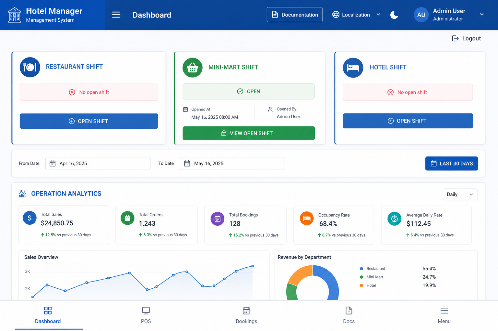
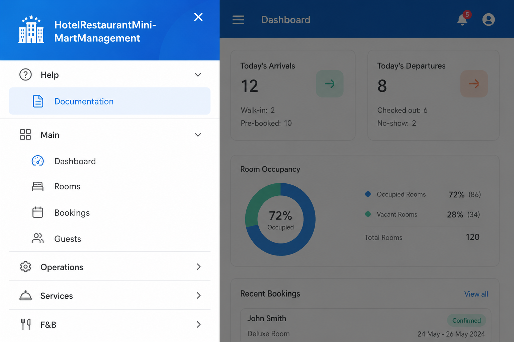
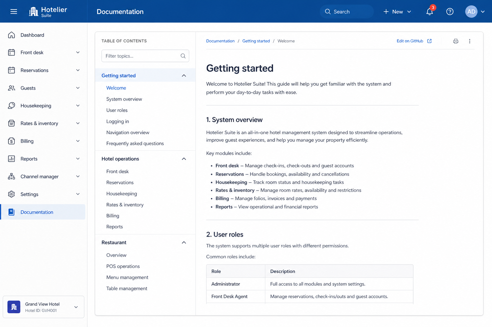
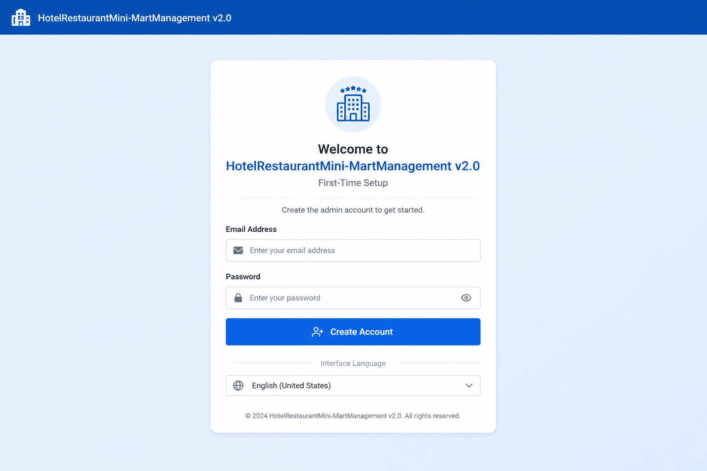
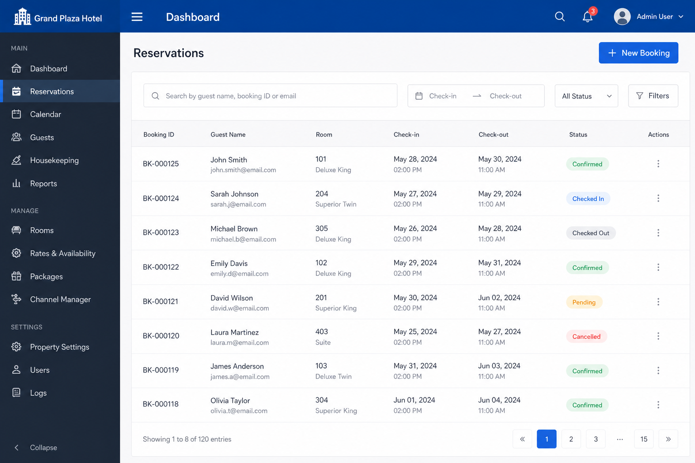
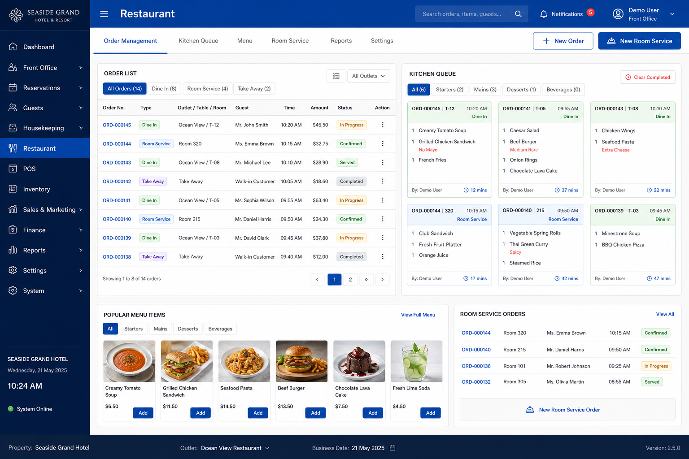
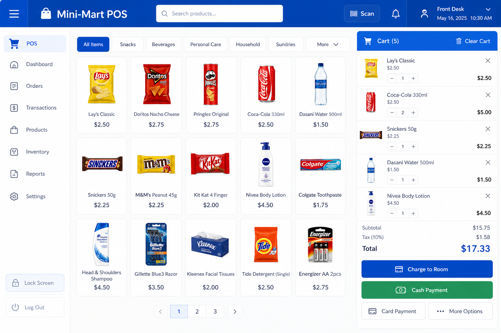
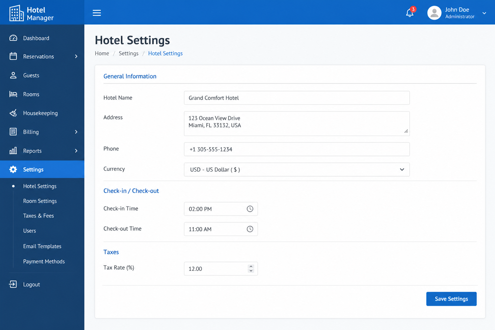

# Visual guide (screenshots)

Illustrated tour of **HotelRestaurantMini-MartManagement** — use with the in-app **Help → Documentation** panel or this guide when training staff.

> Screenshots show representative UI layouts. Your theme (light/dark) and language may differ slightly.

---

## Dashboard

Main landing page after login. Shows **shift status** for Restaurant, Mini-Mart, and Hotel, plus date filters and operation analytics.

| Area | What to look for |
|------|------------------|
| **Shift bars** | Open/close shifts per department (green = open) |
| **Date range** | Filter dashboard metrics |
| **LAST 30 DAYS** | Quick range preset |
| **Bottom nav** | Dashboard · POS · Bookings · Docs · Menu |

---

## Help menu & documentation

Open the **☰ Menu** (or bottom **Menu** on mobile). **Help** is at the top — tap **Documentation**.

Documentation opens **inside the app** (not a separate website). It follows your **interface language** (21 locales).

| Access point | Location |
|--------------|----------|
| Top bar | **Documentation** button |
| Sidebar | **Help → Documentation** |
| Mobile | Bottom **Docs** |

---

## First-time setup

Shown on first visit or when starting fresh. Creates your **Admin** account and **data namespace**.

See [First-time setup](first-time-setup.md) for field details and reset options.

---

## Bookings

Create reservations, check guests in/out, and link stays to billing.

See [Hotel operations](hotel-operations.md) for the full booking workflow.

---

## Restaurant & kitchen

Table floor, room service, kitchen queue, and payments.

See [Restaurant & kitchen](restaurant-and-kitchen.md).

---

## Mini-mart / POS

Retail sales — walk-in cash/card or **charge to room**.

Mobile users: bottom nav **POS** opens the same module.

See [Mini-mart & POS](minimart-and-pos.md).

---

## Settings

Admin-only property configuration: name, currency, taxes, seasons, backup.

See [Settings & configuration](settings-and-configuration.md).

---

## Printing screenshots from docs

When viewing documentation **inside the app**, use your browser **Print** (Ctrl+P). The embedded viewer prints the current help page; app chrome is hidden in print CSS where supported.

## Related

- [Getting started](getting-started.md)
- [Navigation & UI](navigation-and-ui.md)
- [Multilingual documentation](multilingual-documentation.md)
